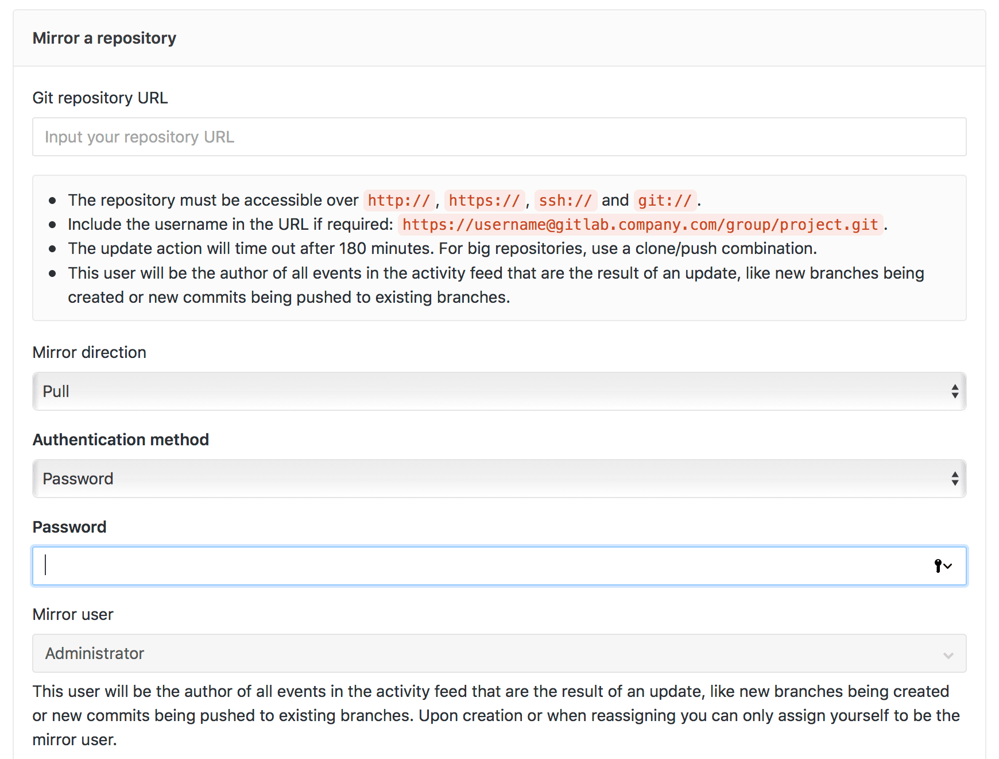
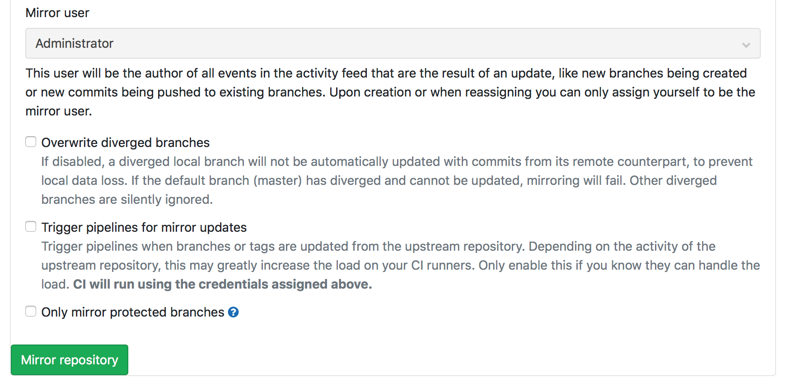

References : 
https://docs.gitlab.com/ee/user/project/repository/repository_mirroring.html

# Pulling from a remote repository 
You can set up a repository to automatically have its branches, tags, and commits updated from an upstream repository.

This is useful when a repository you’re interested in is located on a different server, and you want to be able to browse its content and its activity using the familiar GitLab interface.

To configure mirror pulling for an existing project: 

1. Navigate to your project’s Settings > Repository and expand the Mirroring repositories section.
2. Enter a repository URL.
3. Select Pull from the Mirror direction dropdown.
4. Select an authentication method from the Authentication method dropdown, if necessary.
5. If necessary, check the following boxes:
    - Overwrite diverged branches.
    - Trigger pipelines for mirror updates.
    - Only mirror protected branches. 
6. Click the Mirror repository button to save the configuration. 

  

  

Because GitLab is now set to pull changes from the upstream repository, you should not push commits directly to the repository on GitLab. Instead, any commits should be pushed to the upstream repository. Changes pushed to the upstream repository will be pulled into the GitLab repository, either:

- Automatically within a certain period of time.
- When a forced update is initiated. 

> Caution: If you do manually update a branch in the GitLab repository, the branch will become diverged from upstream and GitLab will no longer automatically update this branch to prevent any changes from being lost. Also note that deleted branches and tags in the upstream repository will not be reflected in the GitLab repository.