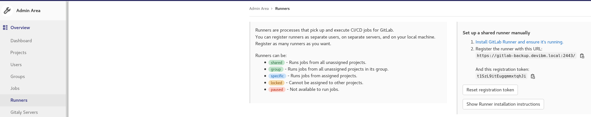

[Retour menu principal](../README.md)

## 11. Gitlab runner

### Kubernetes installation using Helm

Installation documentation : 

- https://docs.gitlab.com/runner/install/kubernetes.html

First add the helm repo and download the chart :

```shell
helm repo add gitlab https://charts.gitlab.io
helm fetch --untar gitlab/gitlab-runner
```

Once the chart is downloaded, you can inject your Gitlab server URL and runner token in the `values.yaml` file. The runner token can be a shared one or a specific one. Specific runner are created from a project in Gitlab and shared runner are created from the admin area.

<p align="center">
  
</p>

values.yaml :

```yaml
## The GitLab Server URL (with protocol) that want to register the runner against
## ref: https://docs.gitlab.com/runner/commands/README.html#gitlab-runner-register
##
gitlabUrl: https://gitlab-backup.devibm.local:2443/

## The Registration Token for adding new Runners to the GitLab Server. This must
## be retrieved from your GitLab Instance.
## ref: https://docs.gitlab.com/ce/ci/runners/README.html
##
runnerRegistrationToken: "t1SzL9itEugqmmxtqhJi"
```

If you have a TLS secured Gitlab server, you will need to upload the certificate to the runner. First fetch the certificate from the server : 

```shell
openssl s_client -showcerts -connect gitlab-backup.devibm.local:2443 | openssl x509 -outform PEM > gitlab-backup.pem
```

Then create a kubernetes secret with the fetched certificate file. The secret must be created in the same namespace as the gitlab runner is installed :

```shell
kubectl create secret generic gitlab-backup-cert --namespace gitlab-runner --from-file=gitlab-backup.crt
```

And finally update your `values.yaml` to take into account this secret :

```yaml
## Set the certsSecretName in order to pass custom certficates for GitLab Runner to use
## Provide resource name for a Kubernetes Secret Object in the same namespace,
## this is used to populate the /home/gitlab-runner/.gitlab-runner/certs/ directory
## ref: https://docs.gitlab.com/runner/configuration/tls-self-signed.html#supported-options-for-self-signed-certificates
##
certsSecretName: "gitlab-backup-cert"
```

You can now install your gitlab runner in your kubernetes cluster :

```
helm upgrade -i runner --namespace gitlab-runner gitlab-runner/
```

If you run into a `x509 certificate unknow authority` error with your gitlab runner container, you might need to use a slight workaround. You can modify the 
`/templates/_env_vars.tpl` file from the gitlab runner helm chart to add following lines in the `{{- define "gitlab-runner.runner-env-vars" }}` section :

```tpl
- name: CI_SERVER_TLS_CA_FILE
  value: /home/gitlab-runner/.gitlab-runner/certs/gitlab-backup.crt
```

Then reinstall the gitlab runner instance and everything should be working properly this time.

### OpenShift using helm (Airgap)

With OpenShift, you will most certainly encounter errors regarding the uid of user executed to run the pod as usual. You can just run the following command :
```
oc adm policy add-scc-to-group anyuid system:serviceaccounts:gitlab-runner
```
If you use the `default` serviceAccount to execute your jobs, you may need to grant permissions :
```
kubectl create clusterrolebinding gitlab-runner --clusterrole=cluster-admin --serviceaccount=gitlab-runner:default
```

It's very important to specify information about the runner under the section `runners.config` such as following :

```yaml
runners:
  config: |
    [[runners]]
      [runners.kubernetes]
  config: |
    [[runners]]
      [runners.kubernetes]
        helper_image = "custom-registry.apps.ocpdata.mpl.michelin.com/gitlab-runner/gitlab-runner-helper:x86_64-5316d4ac"
        #tls_verify = false
        pull_policy = ["always"]
        image_pull_secrets = ["custom-registry"]
        privileged = true
        namespace = "{{.Release.Namespace}}"
        image = "ubuntu:16.04"
```
`helper_image` specifies a custom URL for the private registry to fetch the helper image
`image_pull_secrets` aim at providing the docker secret credentials for the private registry.

You will have to register the certificate of your private registry in the trusted root certificate of your cluster : 
```
oc create cm trusted-registries -n openshift-config --from-file=registry.example..5000=/home/user/docs/cert.pem
oc patch image.config.openshift.io/cluster --patch '{"spec":{"additionalTrustedCA":{"name":"trusted-registries"}}}' --type=merge
```

If for any reason, you need to remove some runners from the GUI : 
```
curl -sS --header "PRIVATE-TOKEN:token" "https://gitlab.michelin.com/api/v4/runners/" | jq '.[] | select(.status == "not_connected") | .id' | xargs -I runner_id curl -S --request DELETE --header "PRIVATE-TOKEN:token" "https://gitlab.michelin.com/api/v4/runners/runner_id"
```

### Docker using docker-compose

You need first to install and run the gitlab runner on your machine with a `docker-compose.yaml` file :

```yaml
version: '3.8'
services:
  gitlab-runner:
    image: gitlab/gitlab-runner:alpine-v14.6.0
    container_name: gitlab-runner
    restart: unless-stopped
    volumes:
      - .:/etc/gitlab-runner
      - /var/run/docker.sock:/var/run/docker.sock
      - /etc/resolv.conf:/etc/resolv.conf:ro
```

You don't need any `config.toml` file, and you will get errors when displaying container logs :
```console
[root@workstation ~ ]$ sudo docker logs gitlab-runner                                                                                                             
Runtime platform                                    arch=amd64 os=linux pid=7 revision=5316d4ac version=14.6.0
Starting multi-runner from /etc/gitlab-runner/config.toml...  builds=0
Running in system-mode.                            
                                                   
Configuration loaded                                builds=0
listen_address not defined, metrics & debug endpoints disabled  builds=0
[session_server].listen_address not defined, session endpoints disabled  builds=0
ERROR: Failed to load config stat /etc/gitlab-runner/config.toml: no such file or directory  builds=0
ERROR: Failed to load config stat /etc/gitlab-runner/config.toml: no such file or directory  builds=0
ERROR: Failed to load config stat /etc/gitlab-runner/config.toml: no such file or directory  builds=0
```

Just run the registration script :

```bash
#!/bin/bash
CONTAINER_NAME=gitlab-runner
URL="https://gitlab.example.com"
TOKEN="wNz7f4N6EoXzgsUwtHgP"
NAME="bastion-runner"
EXECUTOR="docker"
IMG="alpine:latest"
TAG="bastion"

docker exec -it ${CONTAINER_NAME} gitlab-runner register --url ${URL} \
	                                                 -r ${TOKEN} \
		                                         --name ${NAME} \
				                         --executor ${EXECUTOR} \
				                         --docker-image ${IMG} \
				                         --tag-list ${TAG} \
				                         --docker-volumes "/var/run/docker.sock:/var/run/docker.sock" \
					                 --docker-privileged \
					                 --non-interactive
```


```console
[root@workstation ~ ]$ sudo ./register-runner.sh                                          
Runtime platform                                    arch=amd64 os=linux pid=24 revision=5316d4ac version=14.6.0
Running in system-mode.                            
                                                   
Registering runner... succeeded                     runner=wNz7f4N6
Runner registered successfully. Feel free to start it, but if it's running already the config should be automatically reloaded! 
```

You runner will be registered properly

